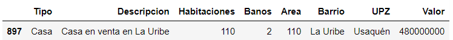

# Resolution of Challenges of the First Course of Alura Latam's Data Immersion Week

At the end of the first class in the Data Immersion Week with Alura Latam, the instructors left the following two challenges:

**1. Calculate the mean area of all real states on each neighborhood of the data set. Show the top 10.**

**2. Check other statistics data, like: count, median, minimum and maximum value.**

For the first challenge I wrote the next code:

```python
mean_area_barrios = inmuebles.groupby('Barrio')['Area'].mean() 
mean_area_barrios
```

What this line does is to select the column `Area` which has been grouped depending on the unique values found in the column `Barrio`. Afterwards, the mean area per neighborhood (*Barrio*) is calculated with the `mean()` function and asign to the variable `mean_area_barrios`.

To select the top 10, the values were first sort in descending order, then the function `head()` was used to select the top 10.

```python
mean_area_barrios.sort_values(ascending = False, inplace = True) 
top10_barrios = mean_area_barrios.head(10)
```

Besides obtaining the mean area per neighborhood, the instructors also ask us to plot the results. With the use of the Matplotlib library, I wrote the next line to display a barplot.

```python
top10_barrios.plot.bar(color = 'purple')
plt.title('Top 10 Barrios')
plt.ylabel('Área promedio m^2')
plt.xlabel('Barrios')
```

Which generate the following plot:


The plot shows that the properties located in the Modelia neighborhood have the highest mean area of the dataset, being around 4316 m^2. The difference with regard to the second place, Libertador neighborhood, is about 85%. This result could be due to outliers in the dataset that weren't treated and are now affecting the estimations.

For the second challange, where we are ask to estimate statistics variables like count, median, and minimum and maximum values. First I decided to find the count of properties for each UPZ per type(*Unidad de Planeamiento Zonal*). The types of properties are:


```python
tipo_upz_count = inmuebles.groupby('UPZ')['Tipo'].value_counts().unstack(level=-1).fillna(0)
```

And plot the result with a barplot:


According to it, apartments predominate with respect to the types of real estate for sale in Bogota. The UPZ Usaquén has the largest number of properties for sale. But it should be remembered that the data have not been properly treated.

Continuing with the task, I intend to obtained the minimum, maximum, mean and median values of the real estate price (`Valor` column) per UPZ. However, the values data type and format must be modified in order to realize this calculation, since originally the column has a `object` data type with the format `$ xxx.xxx.xxx`, where x are the digits to be obtained and the change into a `Int` data type.

For the above, the next code was written:

```python
inmuebles['Valor'] = inmuebles['Valor'].replace({'[^0-9]':''}, regex = True).str.strip()
inmuebles['Valor'] = inmuebles['Valor'].astype('int64')
inmuebles.dtypes
```

The change of data type can be seen in:


Now some statistical variables can be estimated.

```python
valor_upz = inmuebles.groupby('UPZ')['Valor'].agg(['min', 'max', 'mean', 'median'])
```


Since the maximum and the mean are too far apart, I decided to focus on the median and plot it.


This shows, that the value of the real estate located in the Lucero UPZ has the highest median compared to the other UPZs. In addition, with respect to the dataset, it is above by 32%. Which can be do to some outliers that need to be treated.

During the class, the instructors also suggested to complete the following challenges:

1. The cheapest house.
2. The cheapest apartment.
3. The house with the greater number of bathrooms.
4. The house with the greater number of rooms.
5. Show a statistic summary.

To find the cheapest house, I execute the next line:

```python
min_valor = inmuebles[inmuebles['Tipo']=='Casa']['Valor'].min()
```

Which result in the number`85000000`, meaning that the cheapest house costs 85,000,000 COP. And to find the real estate or estates with this price, I write the following:

```python
inmuebles.query('Tipo == "Casa" & Valor == @min_valor')
```

Resulting in:


To find the cheapest apartment and the house with the greater number of bathrooms and rooms, a similar procedure was realized.

```python
min_valor_apto = inmuebles[inmuebles['Tipo']=='Apartamento']['Valor'].min()
inmuebles.query('Tipo == "Apartamento" & Valor == @min_valor_apto')
```

Cheapest apartment:


```python
max_banos_casa = inmuebles[inmuebles['Tipo']=='Casa']['Banos'].max()
inmuebles.query('Tipo == "Casa" & Banos == @max_banos_casa')
```

Houses with the most number of bathrooms:


```python
max_hab_casa = inmuebles[inmuebles['Tipo']=='Casa']['Habitaciones'].max()
inmuebles.query('Tipo == "Casa" & Habitaciones == @max_hab_casa')
```

House with the most number of rooms:



For the last challenge, the function `describe()` was apply to the dataframe, obtaining the following:

