# Resolution of Challenges of the Second Course of Alura Latam's Data Immersion Week

At the end of the second class in the Data Immersion Week with Alura Latam, the instructors left the following two challenges:

**1. Have a better understanding of the values histogram plot, select 3 types of real estates and improve the plot by adding a title, increasing the labels size, changing the colors and writing a conclusion.**

**2. Calculate the price per m^2 for each neighborhood and choose the appropriate plot for this new variable.**

## First Challenge Resolution

To improve the plot made during the class, I made use of the library Seaborn along with Matplotlib. And wrote the following code to change the color palette, add labels and change the font size.

```python
# canvas for the plot
plt.figure(figsize=(10,8)) # figsize = (width, hight)
sns.set_style("whitegrid")
g1 = sns.histplot(data = inmuebles, x = 'Precio_Millon', kde = True, hue='Tipo', palette='Set3') 
g1.set_title('Distribución de Valores de los inmuebles en Bogotá', fontsize=25)
# x axe limit
plt.xlim((50, 1000)) # for the fist value we take a number close to the minimum
plt.xlabel("Precio en Millones de COP", fontsize=20)
plt.ylabel("Frecuencia de los inmuebles", fontsize=20)
plt.show()
```

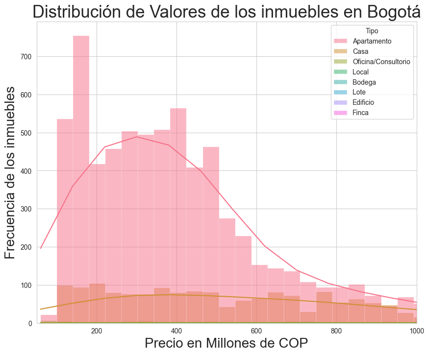

To select three types of real estates, I decided to find the 3 less frequent real states. For which I wrote the next line:

```python
inmuebles.Tipo.value_counts().sort_values()
```

Resulting in the types: **Lote, Finca and Bodega**.

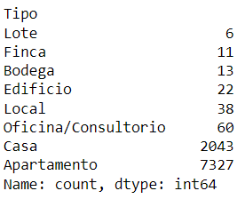

Then, I select this three types from the dataframe and asign them to a new variable, from which I obtain the statistics summary to have an overview of the data and plot a better histogram.

```python
# create mask to select the three types of real estate
mask = (inmuebles['Tipo'] == 'Lote') | (inmuebles['Tipo'] == 'Finca') | (inmuebles['Tipo'] == 'Bodega')
# apply mask to the inmuebles DF and asign to a new DF
down_3 = inmuebles[mask]
# display statistics summary
down_3.describe()
```

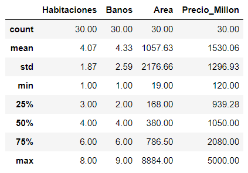

From the results it is determine that there are no needs to modify the plot, but this would be revise again after plotting it.

For this data a histogram plot was again choose, but since only three types are display and for a better comparision the bars are put side to side. 

```python
plt.figure(figsize=(10,8)) # figsize = (ancho, altura)
sns.set_style("whitegrid")
g3 = sns.histplot(data = down_3, x = 'Precio_Millon', kde = True, hue='Tipo', palette='husl', multiple='dodge') 
g3.set_title('Distribución de Valores de 3 Tipos de inmuebles en Bogotá', fontsize=15)
plt.ylabel('Cantidad de inmuebles', fontsize=12)
plt.xlabel('Precio en Millones COP', fontsize =12)
sns.move_legend(g3, loc='upper center', ncol=3, title='Tipo de inmueble')
plt.show()
```

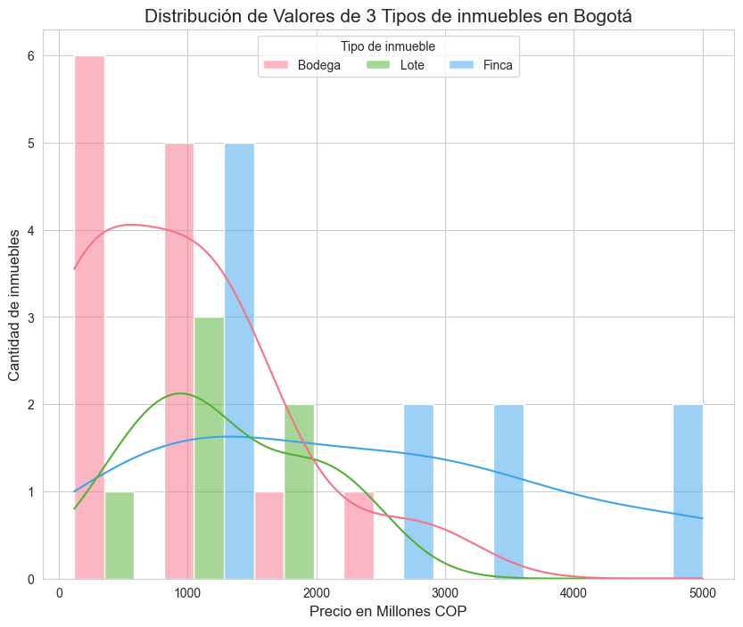

### First Challenge Conclusions

❇️ Most of the warehouses (*bodega*) have a value greater than 100M COP.
❇️ More than half of the farms (*lote*) in the data set cost more than 2000M COP.
❇️ The price of the lots is not more than 2000M COP.

## Second Challenge Resolution

The tasks of this challenge are to calculate the square meter price for each neighborhood and to choose an appropriate plot to analyze it.

For that I first need to group the columns `Area` and `Precio_Millon` per neighborhood (column `Barrio`) and obtain the sum of the values.

```pyhton
acumulado_barrios = inmuebles.groupby('Barrio')[['Area', 'Precio_Millon']].sum()
```

I then proceed to calculate the price per square meter, add it as a new column in the DataFrame `acumulado_barrios` and, display the 10 firsts rows.

```python
acumulado_barrios['Precio_m2'] = acumulado_barrios['Precio_Millon']/acumulado_barrios['Area']
acumulado_barrios.head(10)
```

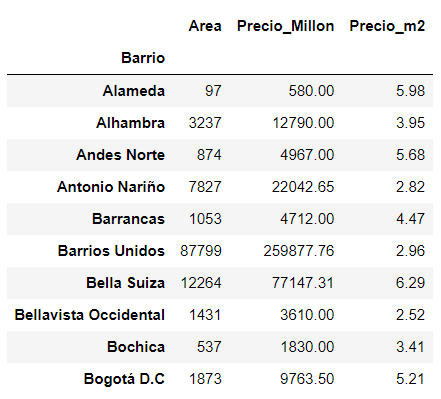

Next, I reset the index of the `acumulado_barrios` DataFrame to have it as a column, to the select it along with the column `Precio_m2` and create a new DataFrame with this values for later use.

```pyhton
m2_barrio = acumulado_barrios.reset_index()[['Barrio','Precio_m2']]
```

Bogotá Mayor's Office has different divisions for the district depending on various necesities, like *Localidades* and *UPZ*. But the common citizen also has made some informal divisions that are more related to the geographic location of the sector, like the ones seen in the image below.

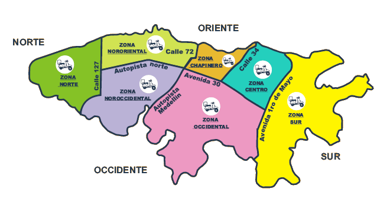

Becaues this divisions is more common knowledge for the citizens of Bogota and has less zones than the UPZ division, I choosed to do the analysis of the distribution of price per square meter in this zones instead of the neighborhoods.

But, since the current dataset doesn't count with this information, I turn to the original dataset without treatment, to check if it contains the infomation a want.

```python
# load the original dataset
inmuebles_original = pd.read_csv('../data/inmuebles.csv')
# check the columns and if it has the same number of rows as my current dataset
inmuebles_original.info()
```

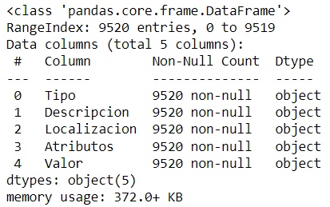

Happy that the DataFrame has the same number of rows, I then check what kind of information is contain in the columns, specially the column `Localizacion` which is the most probable to have the zones that a seek.

```python
inmuebles_original.sample(5)
```

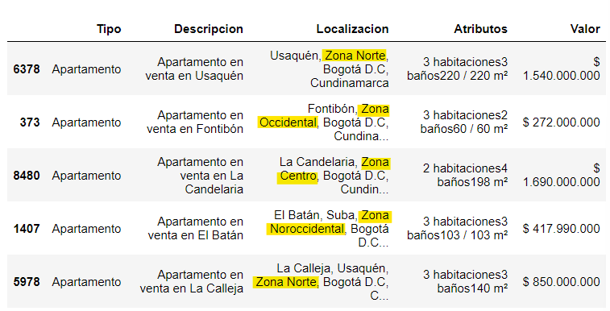

Even more thrilled that the division I want is in the dataset as shown in the previous image. Now I need to extract it and added to the DataFrame I'm currently working with, `inmuebles`. For which I write the following code:

```python
# split the string on the "," and store the values in a list
localizacion = inmuebles_original['Localizacion'].str.split(',')
# function to extract the zone from the list
def get_zone(lst):
    for element in lst:
        if 'zona' in element.lower():
            return element.strip()
    return None
# apply the function to the DF localizacion and assign the result to a new column on the DF inmuebles
inmuebles['Zona'] = localizacion.apply(get_zone)
# show top 5
inmuebles.head()
```

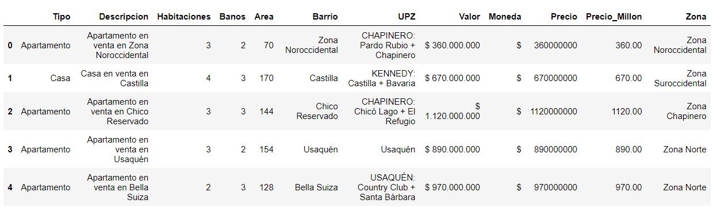

The zones found on the dataset are:
*- Zona Noroccidental*
*- Zona Suroccidental*
*- Zona Chapinera*
*- Zona Norte*
*- Zona Occidental*
*- Zona Franca*

Now that we have calculated the square meter price per neighborhood and obtained the the common zones in which the neighborhoods are located, we can integrated this data into the `inmuebles` DataFrame.

```python
# add price to dataset
inmuebles = pd.merge(inmuebles, m2_barrio, on='Barrio')
inmuebles.sample(5)
```

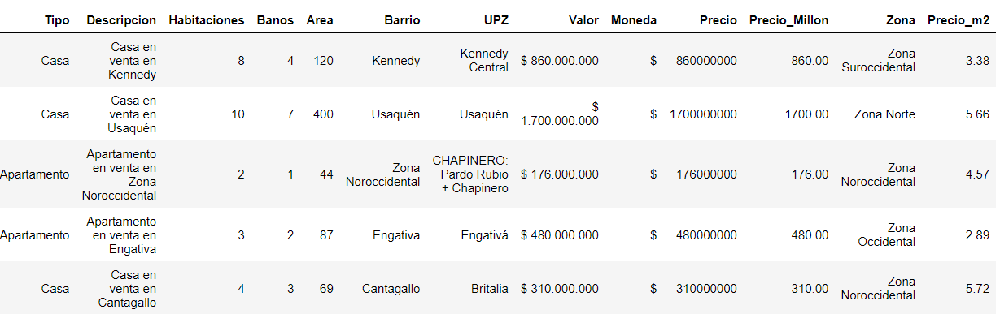

With the final DataFrame we then proceed to generate a boxplot for the distribution of the square meter price in every zone.

```python
plt.figure(figsize=(15,8)) # figsize = (width, hight)
g4 = sns.boxplot(data=inmuebles, x='Zona', y='Precio_m2', palette='husl')
g4.set_title('Distribución precio m^2 por zona')
plt.ylabel('Precio Millones COP del m^2')
plt.xlabel('Zona')
plt.show()
```

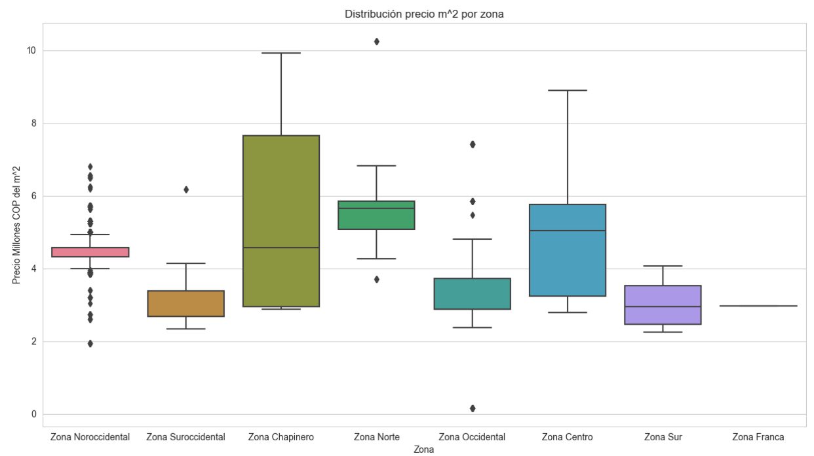

### Second Challenge Conclusions

❇️ The m^2 price for the neighborhoods located in the Chapinero Zone are the most disperse of all the zones. 
❇️ The North Zone presents the hightest median value, although there are a large number of real estates in the Chapinero Zone that have a higher m^2 price.
❇️ There are a large quantity of outliers at the Noreast zone. Needs further analysis.
❇️ Real estates located at the North and Chapinero are the most expensive.
❇️ Real estates located at the Southeast, east and south of the city have a similar m^2 price.
