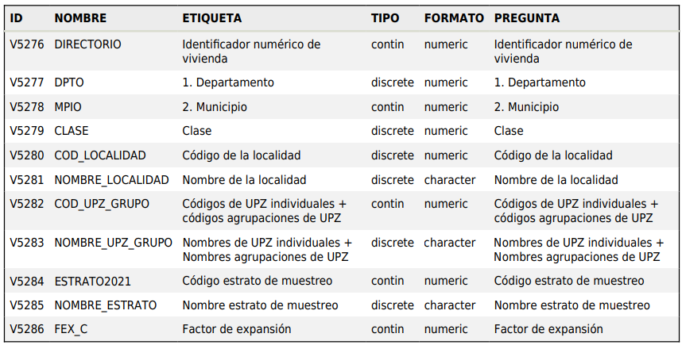
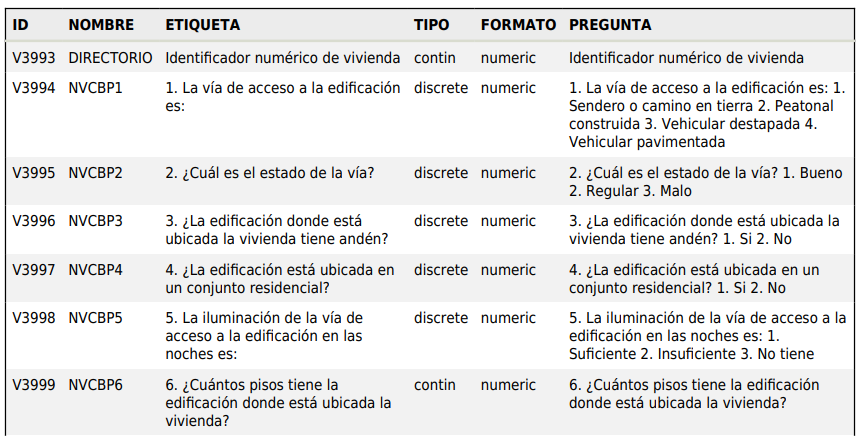
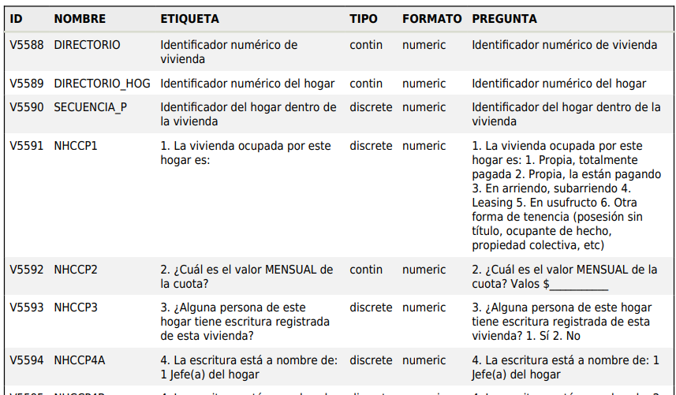
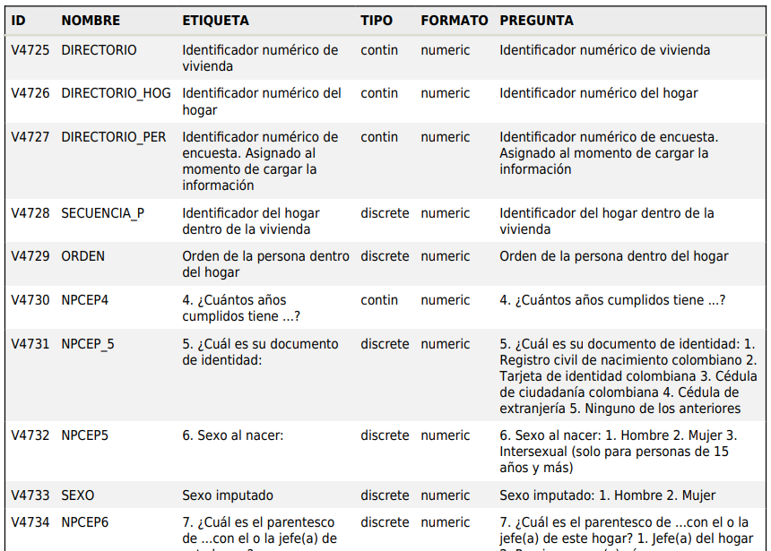
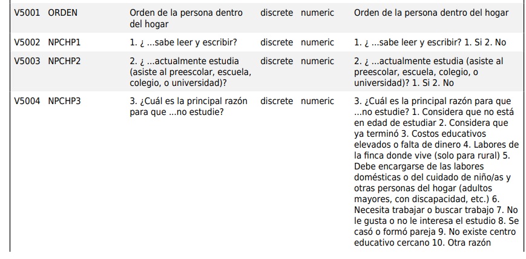
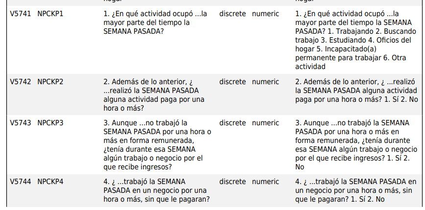
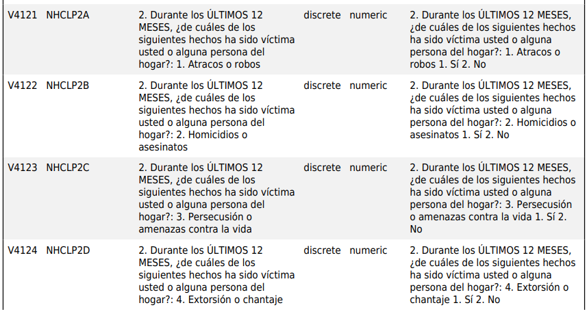

# Resolution of Challenges of the Third Course of Alura Latam's Data Immersion Week

At the end of the third class in the Data Immersion Week with Alura Latam, the instructors left the following two challenges:

**1. Take a look at the DANE database, understand these variables conceptually to better understand the context of this database. And select the variables to believe can be use to predicte the price of a real estate.**

**2. Organize your notebook so that your project is better presented.**

## First Task Resolution

This time, the task are about analizing documentation with little to code. Therefor I will document a summary of my findings while reading the documentation of the DANE database.

The datasets used for this project can be found and are free to download at the [DANE's website](https://microdatos.dane.gov.co/index.php/catalog/743/study-description). This datasets belong to the "*Encuesta Multipropósito Bogotá - Cundinamarca - MS - 2021*" (Multipurpose Survey Bogota - Cundinamarca - MS - 2021). Accordig to the metodoly sheet, the reach of this survey is:

> The Bogota - Cundinamarca Multipurpose Survey (EM 2021) is a statistical operation that collects information on different aspects of the living conditions and payment capacity of the inhabitants of Bogota and selected municipalities in the department of Cundinamarca.

The data were divided into 14 data sets on different aspects of economic capacity and living conditions. Of these, 7 were selected at the discretion of the instructor for the development of the project.

For the understanging of these 7 datasets, the [documentation](https://microdatos.dane.gov.co/index.php/catalog/743/pdf-documentation) provided by the DANE will be use.

### *Identificación (Capítulo A)* - Identification (Chapter A)

This table contains information on the survey identification variables shown in the image below.



The relevant variables of this table for the predective modele are:

- `DIRECTORIO:` Key that will allow to join the different tables.
- `MPIO:` Numeric identifier of the municipality. With it we can select only the information belonging to Bogotá, that has the municipality identifier 11001.
- `COD_UPZ_GRUPO:` Key that will allow to combine our real estates dataset with the responses from the multipurpose survey.

### *Datos de la vivienda y su entorno (Capítulo B)* - Data on the residence and its surroundings (Chapter B)

This table cointains information about the house and its surroundings, as well as access roads and lighting. Characteristics and housing conditions of the dwelling. Information about whether the dwelling is affected by structural and location problems. Information about the risk of the housing environmental problems due to the location near sources of damage. Coverage of public utilities.

The image shows a extract of the variables found in the table.



The table is composed of 63 varibles, with a numeric data type that correspond to a categorical key. The relevant variables from this table could be:

- `DIRECTORIO:` Key
- `NVCBP1:` Type of access road to the dwelling.
- `NVCBP2:` State of the road.
- `NVCBP4:` If located in a enclose residencial unit.
- `NVCBP5:` Lighting of the access road.
- `NVCBP7:` If has a lift.
- `NVCBP9:` If part of the dweling has a industry, commerce or service activity.
- `NVCBP10:` Type of the dweling. House, apartment, room, other.
- `NVCBP11A:` If has electric energy.
- `NVCBP11B:` If has aqueduct.
- `NVCBP11C:` If has sewage.
- `NVCBP11D:` If the garbage is recolected.
- `NVCBP14D:` If close to bus terminals.
- `NVCBP15C:` If presents problems of insecurity.
- `NVCBP14A:` If close to fabrics.
- `NVCBP14B:` If close to dumpster.
- `NVCBP14C:` If close to mark square or slaughterhouse.
- `NVCBP14E:` If close to discotecs or bars.
- `NVCBP14L:` If close to brothel.
- `NVCBP14F:` If close to drug sales.
- `NVCBP14G:` If close to dark, empty lands.
- `NVCBP14I:` If close to residual water recolectors.
- `NVCBP15A:` If the surroundings are noisy.

### *Condiciones habitacionales del hogar (Capítulo C)* - Household living conditions (Chapter C)

This chapter contains information on households that own their own dwelling, renter households, and households that live in another condition. Information on the amount of expenses incurred by the household in order to have the right to inhabit the dwelling. Information on the sources of financing used by households to purchase housing. Information on the quality of housing in terms of space and the characteristics of the services and equipment available. Information regarding housing subsidies granted by the government or other institution. Information on households that sort garbage and households that engage in waste reduction practices. Households that carry out practices to reduce water and energy consumption.

The image shows a extract of the variables found in the table.



The table is composed of 142 varibles, with a numeric data type that correspond to a categorical key. The relevant variables from this table could be:

- `DIRECTORIO:` Key.
- `NHCCP3:` If has a deed.
- `NHCCP14:` If pays monthly administration or guardianship.
- `NHCCP19:` Number of rooms, including living room and dining room.
- `NHCCP22A:` If has a front or backyard.
- `NHCCP22C:` If has a garage or parking spot.
- `NHCCP24:` If has a kitchen.
- `NHCCP26:` Type of energy or combustible is use to cook.
- `NHCCP28:` If water supply is 7 days of the week.
- `NHCCP29:` If water supply is 24 hours of the day.
- `NHCCP31:` Type of toilet.
- `NHCCP32:` Number of toilets.
- `NHCCP35A:` Number of shower rooms.
- `NHCCP36B:` If has a laundry room.
- `NHCCP46A:` Time walking to the closest TransMilenio station. Minutes.
- `NHCCP46B:` Time walking to the closest SITP bus stop. Minutes.
- `NHCCP46C:` Time walking to the closest bus stop. Minutes.
- `NHCCP46D:` Time walking to the closest intermunicipal bus terminal. Minutes.
- `NHCCP46E:` Time walking to the closest park or green zone. Minutes.
- `NHCCP46F:` Time walking to the closest supermarket or groccery store. Minutes.
- `NHCCP46G:` Time walking to the closest farmacy. Minutes.
- `NHCCP47A:` If there is dogs.
- `NHCCP47B:` If there is cats.

### *Composicion del hogar y demografia (Capítulo E)* - Household composition and demographics (Chapter E)

This table contains basic information on the size, distribution and demographic dynamics of the population in Bogota and selected municipalities. Socio-demographic characteristics of the resident population in Bogota and the selected municipalities. Persons making up the household and the family nucleus corresponding to the head of household. Information on long- and short-term migration, as well as between urban and rural areas and between neighborhoods or hamlets.

The image shows a extract of the variables found in the table.



The table is composed of 68 varibles, with a numeric data type that correspond to a categorical key. The relevant variables from this table could be:

- `DIRECTORIO:` Key.

### *Educación (Capítulo H)* - Education (Chapter H)

This table contains the main educational characteristics
of the population aged 5 years and older: literacy, school attendance, levels achieved and years of study. Information about the reasons for non-attendance of the school-age population. Information about the means of transportation and the time used to travel to school. Information about the means of transportation and the time used to travel to the educational establishment. Information about subsidies, scholarships and educational credits, as well as the entities that grant them. Household expenditure on education. Information about the person with with whom children between the ages of 5 and 17 stay.

The image shows a extract of the variables found in the table.



The table is composed of 136 varibles, with a numeric data type that correspond to a categorical key. The relevant variables from this table could be:

- `DIRECTORIO:` Key.
- `NPCHP4:` Last highest level of education.
- `NPCHP18AA:` If Transmilenio to the educational center.
- `NPCHP18AB:` If SITP Bus to the educational center.
- `NPCHP18AC:` If Bus to the educational center.
- `NPCHP18AD:` If car to the educational center.
- `NPCHP18AE:` If Taxi to the educational center.
- `NPCHP18AF:` If Motorbike to the educational center.
- `NPCHP18AG:` If bicycle to the educational center.
- `NPCHP18AH:` If bus route to the educational center.
- `NPCHP18AI:` If by foot to the educational center.
- `NPCHP18AJ:` If "bicitaxi" or "mototaxi" to the educational center.
- `NPCHP19:` Time to the educational center, including waiting time. Minutes.
- `NPCHP21AA:` Tuition value paid.

### *Fuerza de trabajo (Capítulo K)* - Work force (Chapter K)

Information on the economic activity of the population of Bogota and selected municipalities of Cundinamarca. Information about the persons within the household who earn income and whether this income comes from their involvement in the labor market or from other activities or transfers. Information on the working conditions of the employed, such as access to social security, hours worked, income, secondary employment. This chapter can be used to characterize the unemployed and inactive people, determining whether they receive income from other sources such as help from family, friends or institutions. Information on the time spent in unpaid activities, with a gender perspective Information on teleworking and working at home in the last 12 months and if the reason for this modality of work was the COVID-19 pandemic.

The image shows a extract of the variables found in the table.



The table is composed of 170 varibles, with a numeric data type that correspond to a categorical key. The relevant variables from this table could be:

- `DIRECTORIO:` Key
- `NPCKP23:` Previous month earnings before discounts.
- `NPCKP46B:` Time to workplace, including waiting time. Minutes.

### *Percepcion sobre las condiciones de vida y el desempeño institucional (Capítulo L)* Perception of living conditions and institutional performance (Chapter L)

Information on significant events that affect the living conditions of households and on the victimization of their members by criminal aggressions during the last 12 months. The information allows us to know the perception of the changes and current state of urban facilities, the environment, some fields of institutional performance of the public administration and the institutional performance of the public administration and equal opportunities for vulnerable population groups Information on households benefiting from national, departmental or municipal government subsidies.

The image shows a extract of the variables found in the table.



The table is composed of 179 varibles, with a numeric data type that correspond to a categorical key. The relevant variables from this table could be:

- `DIRECTORIO:` Key.
- `NHCLP2A:` If robbery victim past 12 months.
- `NHCLP2B:` If homicide victim past 12 months.
- `NHCLP2C:` If persecution or threats victim past 12 months.
- `NHCLP2D:` If extorsion or blackmailing victim past 12 months.
- `NHCLP2E:` If harassment victim past 12 months.
- `NHCLP2AA:` If military conflict between 1995 and now.
- `NHCLP2AB:` If forced displacement victim.
- `NHCLP2AC:` Included at the Unique Victims Register.
- `NHCLP3:` Conditions of living.

The final list of selected variables is:

```python
{
   'NVCBP1': 'TYPE_ACCESS',
   'NVCBP2': 'STATE_ROAD',
   'NVCBP4': 'ENCLOSE_UNIT',
   'NVCBP5': 'LIGHTING',
   'NVCBP7': 'LIFT',
   'NVCBP9': 'PART_COMMERCE',
   'NVCBP10': 'TYPE_DWELING',
   'NVCBP11A': 'ELECTRIC_ENERGY',
   'NVCBP11B': 'AQUEDUCT',
   'NVCBP11C': 'SEWAGE',
   'NVCBP11D': 'GARBAGE_RECOLECTED',
   'NVCBP14D': 'BUS_TERMINAL',
   'NVCBP15C': 'INSECURITY',
   'NVCBP14A': 'FABRICS',
   'NVCBP14B': 'DUMPSTER',
   'NVCBP14C': 'MARKT',
   'NVCBP14E': 'DISCOTEC',
   'NVCBP14L': 'BROTHEL',
   'NVCBP14F': 'DRUG_SALES',
   'NVCBP14G': 'EMPTY_LANDS',
   'NVCBP14I': 'WATER RECOLECTORS',
   'NVCBP15A': 'NOISY',
   'NHCCP3': 'DEED',
   'NHCCP14': 'ADMIN_GUARDIAN',
   'NHCCP19': 'NUM_ROOMS',
   'NHCCP22A': 'YARD',
   'NHCCP22C': 'GARAGE_PARKING_SPOT',
   'NHCCP24': 'KITCHEN',
   'NHCCP26': 'COMBUSTIBLE_COOK',
   'NHCCP28': 'WATER_SUPPLY_7_DAYS',
   'NHCCP29': 'WATER_SUPPLY_24_HOURS',
   'NHCCP31': 'TYPE_TOILET',
   'NHCCP32': 'NUM_TOILETS',
   'NHCCP35A': 'NUM_SHOWER_ROOMS',
   'NHCCP36B': 'LAUNDRY_ROOM',
   'NHCCP46A': 'TIME_WALK_TRANSMILENIO',
   'NHCCP46B': 'TIME_WALK_SITP',
   'NHCCP46C': 'TIME_WALK_BUS_STOP',
   'NHCCP46D': 'TIME_WALK_BUS_TERMINAL',
   'NHCCP46E': 'TIME_WALK_PARK',
   'NHCCP46F': 'TIME_WALK_GROCCERY',
   'NHCCP46G': 'TIME_WALK_FARMACY',
   'NHCCP47A': 'DOGS',
   'NHCCP47B': 'CATS',
   'NPCHP4': 'HIGHEST_EDUCATION',
   'NPCHP18AA': 'TRANSMILENIO_EDUCATION_CENTER',
   'NPCHP18AB': 'SITP_EDUCATION_CENTER',
   'NPCHP18AC': 'BUS_EDUCATION_CENTER',
   'NPCHP18AD': 'CAR_EDUCATION_CENTER',
   'NPCHP18AE': 'TAXI_EDUCATION_CENTER',
   'NPCHP18AF': 'MOTORBIKE_EDUCATION_CENTER',
   'NPCHP18AG': 'BICYCLE_EDUCATION_CENTER',
   'NPCHP18AI': 'WALK_EDUCATION_CENTER',
   'NPCHP18AJ': 'BICI_MOTO_TAXI_EDUCATION_CENTER',
   'NPCHP19': 'TIME_EDUCATION_CENTER',
   'NPCHP21AA': 'TUITION_EDUCATION_CENTER',
   'NPCKP23': 'MONTH_SALARY',
   'NPCKP46B': 'TIME_WORKPLACE',
   'NHCLP2A': 'VICTIM_ROBBERY',
   'NHCLP2B': 'VICTIM_HOMICIDE',
   'NHCLP2C': 'VICTIM_THREATS',
   'NHCLP2D': 'VICTIM_EXTORSION',
   'NHCLP2E': 'VICTIM_HARASSMENT',
   'NHCLP2AA': 'VICTIM_MILITARY_CONFLICT',
   'NHCLP2AB': 'FORCED_DISPLACEMENT',
   'NHCLP2AC': 'RUV',
   'NHCLP3': 'LIVING_CONDITIONS'
}
```
